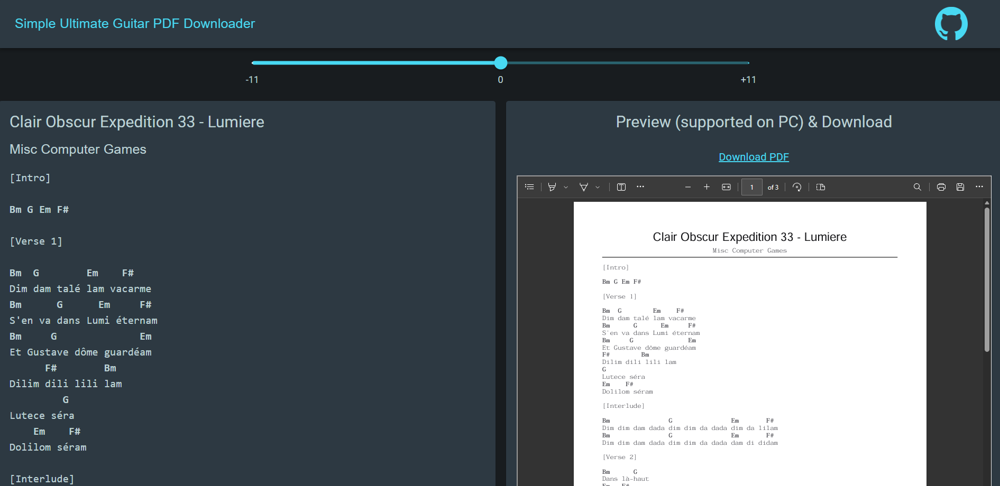
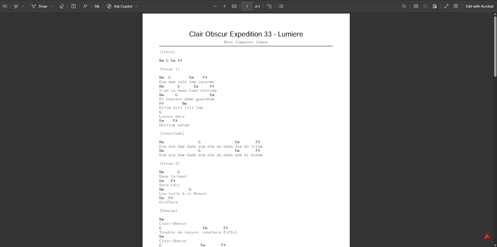
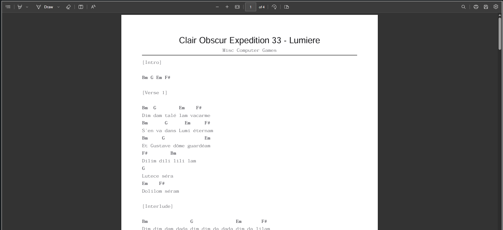

# Simple-UltimateGuitar-PDFDownloader

**Simple-UltimateGuitar-PDFDownloader** is a simple app written in React for practices.
It enables you to:
* View guitar tabs on ultimate guitar
* Download PDF tab
* Preview PDF tab

## Usage
URL: https://simple-ultimateguitar-pdfdownloader.pages.dev/
Just input the URL of your tab in the input field and page will automatically refresh

## Features
* [X] Chord Transposer
* [X] PDF Download link
* [ ] Scrolling bar for command buttons (like transpose, font)
* [ ] Multiple links download
* [ ] Custom styles and variable font size
* [ ] Page space optimization (reduce number of pages)
* [ ] Modern style for webpage
* [ ] Possibility to add or remove chord and meta information (key, tuning, ...)